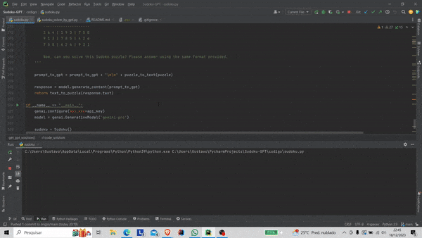

# Sudoku Solver with Gemini

Aplicação que utiliza o modelo de inteligência artificial do Gemini para resolver o jogo do Sudoku. 

Esse projeto foi feito para a disciplina Generative Pre-Trained Transformers da UFES pelos alunos Enzo Cussuol, Gustavo Nahuz e Miguel Carlini.

Tabela de conteúdos
=================
<!--ts-->
* [Descrição](#descrição)
* [Como Baixar](#como-baixar)
* [Dependências](#dependências)
* [Como Rodar o Código](#compilar-e-rodar-o-código)
* [Contribuições](#contribuições)
* [Referências](#referências)
<!--te-->

### Organização das Pastas

- `relatorio.pdf`: Relatório detalhado sobre o desenvolvimento do programa e seus resultados.
- `codigo/`: Pasta contendo o código-fonte do programa.
- `dados/`: Pasta opcional para armazenar dados ou quebra-cabeças Sudoku.

## Descrição


Sudoku é um jogo de lógica que consiste em preencher uma grade de 9x9 com números de 1 a 9, de modo que cada linha, coluna e região de 3x3 contenha todos os números de 1 a 9. É um jogo que oferece regras simples, mas uma experiência desafiadora.

O objetivo do projeto é demonstrar como modelos de linguagem avançados podem ser aplicados a problemas práticos de resolução de quebra-cabeças.

Para resolver este problema, nós nos comunicamos com o Gemini, fazendo requisições através de sua API.

### Funcionamento do Programa

Nós criamos a classe **Sudoku** para representar o jogo, possuindo o tabuleiro com seus valores, a solução e a dificuldade. A classe e tais informações são iniciadas recebendo valores de resposta de uma requisição feita para a API [Dosuko](https://sudoku-api.vercel.app/).

A interface gráfica foi feita com a biblioteca **tkinter**, que permite o display do tabuleiro inicial, com os botões de resolver diretamente com o Gemini ou com o código provido por essa IA. Após o clique, são mostrados a solução correta e a solução obtida.

Como a função que recebe o tabuleiro para display e o retorno da resposta da requisição para a API são diferentes, foi necessário criar as funções "**puzzle_to_text**" e "**text_to_puzzle**".

A função "**get_gpt_solution**" cria o prompt e o envia para a API do Gemini. No prompt, nós explicamos as regras, mostramos um exemplo de tabuleiro inicial e sua solução correta, visindo o melhor desempenho possível dessa IA.


## Como Baixar

Você pode baixar este repositório usando o Git com o seguinte comando:

```bash
$ git clone https://github.com/seu-usuario/sudoku-solver-chatgpt.git
```

Caso não possua o Git instalado, pode baixar o arquivo ZIP clicando em "Code" e depois em "Download ZIP".


## Dependências

- Python 3.9+

Seguintes bibliotecas do Python:
- tikinter
- requests
- google.generativeai
- numpy
- os
- dotenv

```bash
$ sudo apt-get install python3-tk
$ pip install requests
$ pip install numpy
$ pip install -q -U google-generativeai
$ pip install python-dotenv
```

Para que as requisições para a API do Gemini sejam realizadas, é necessário ter uma chave de acesso. Portanto, obtenha a chave nesse [link](https://makersuite.google.com/app/apikey) e adicione ela ao arquivo ``.env``.

```bash
$ cd codigo/
$ touch .env
```
Dentro do ``.env``, adicione a linha:

``API_KEY=<sua-chave>``

## Como Rodar o Código

Certifique-se de ter as dependências necessárias instaladas antes de compilar o código.

Para rodar o programa de resolução de Sudoku:

```bash
$ cd codigo
$ python3 sudoku_solver.py
```

<p align="center">
  
</p>

## Contribuições

Contribuições são bem-vindas! Sinta-se à vontade para abrir um pull request para melhorias ou correções.